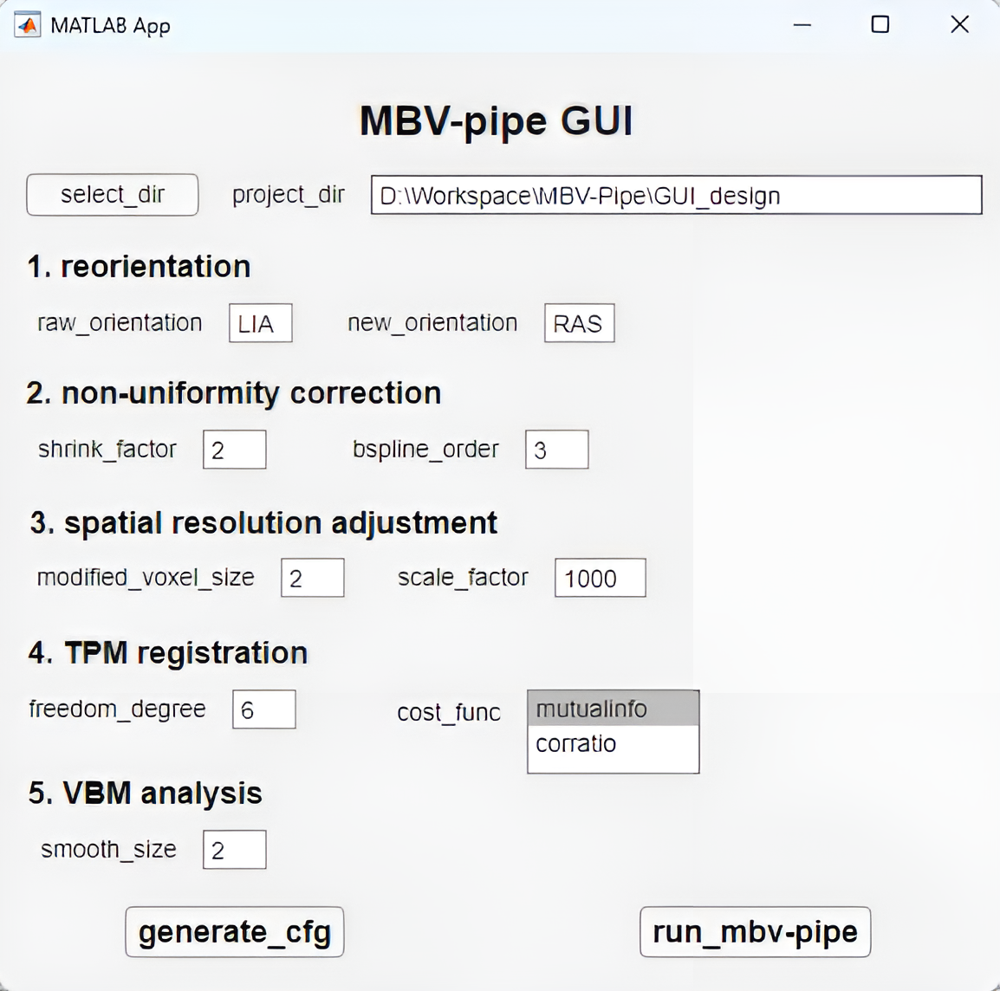
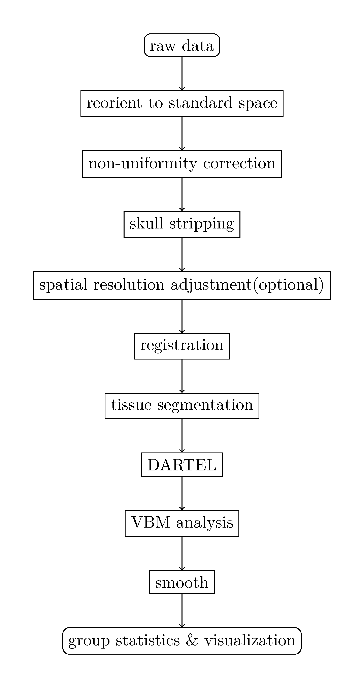
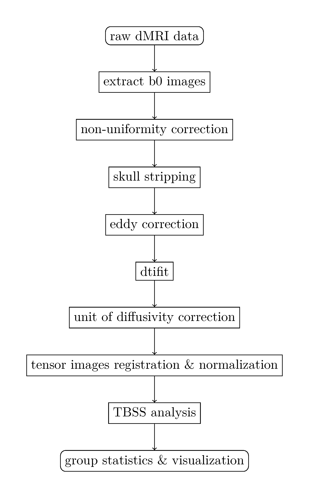

# MBV-Pipe

Mouse Brain Volumetric Statistics-Pipeline

## Requirements
- CentOS >= 7.0
- SHELL >= 4.2
- FSL >= 6.0.5
- MATLAB >= 2022a
- SPM12

## GUI panel
We provide a GUI for mouse brain morphological analysis based on MATLAB. Users can set the necessary parameters to run MBV-Pipe. 

## DARTEL-VBM Analysis
Following is the DARTEL-VBM analysis workflow:

<!--  -->

Step.1: `S1_reorientation.sh`

Step.2: `S2_N4_bias_correction.sh`

Step.3: `S3_skull_stripping.sh`

Step.4: `S4_vox_size_modification.sh`

Step.5: `S5_1_reg2tpm.sh`

Step.6: `S6_1_vbm_analysis.sh`

Step.7: `S7_dartel.sh`

Step.8: `S8_vbm_dartel.sh`

Step.9: `S9_smooth.sh`

Step.10: `S10_save_vbm_dartel_smoothed_results.sh`

## TBSS Analysis
Following is the TBSS analysis workflow:

Step.1: `S1.b0_brain_extraction.sh`

Step.2: `S2.eddy_correction.sh`

Step.3: `S3.dtifit.sh`

Step.4: `S4.prep_for_tbss.sh`

Step.5: `S5.prep_for_dtitk_tbss.sh`

Step.6: `check.sh`

Step.7: `dtitk_src.sh`

## Related Links
- FSL: http://fsl.fmrib.ox.ac.uk
- SPM: https://www.fil.ion.ucl.ac.uk/spm
- ANTs: https://github.com/stnava/ANTs
- DTI-TK: https://dti-tk.sourceforge.net/

## References
Chou, Nigel, et al. "Robust automatic rodent brain extraction using 3-D pulse-coupled neural networks (PCNN)." IEEE Transactions on Image Processing 20.9 (2011): 2554-2564.

Lohmeier, Johannes, et al. "atlasBREX: Automated template-derived brain extraction in animal MRI." Scientific reports 9.1 (2019): 12219.

Penny, William D., et al., eds. Statistical parametric mapping: the analysis of functional brain images. Elsevier, 2011.
